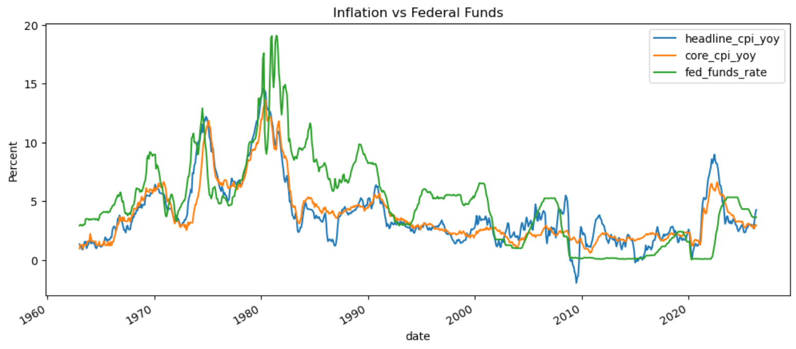
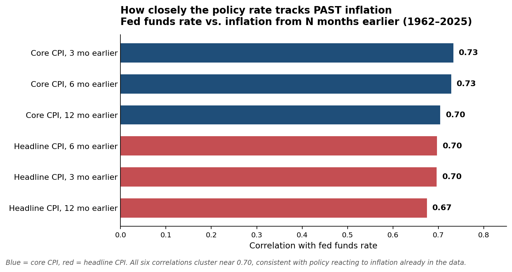
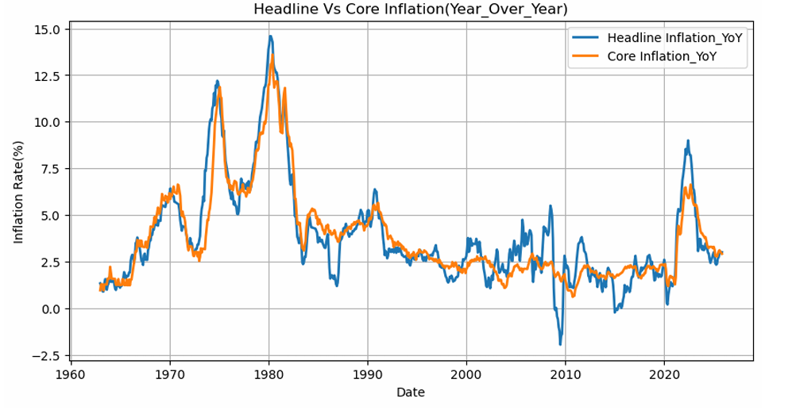
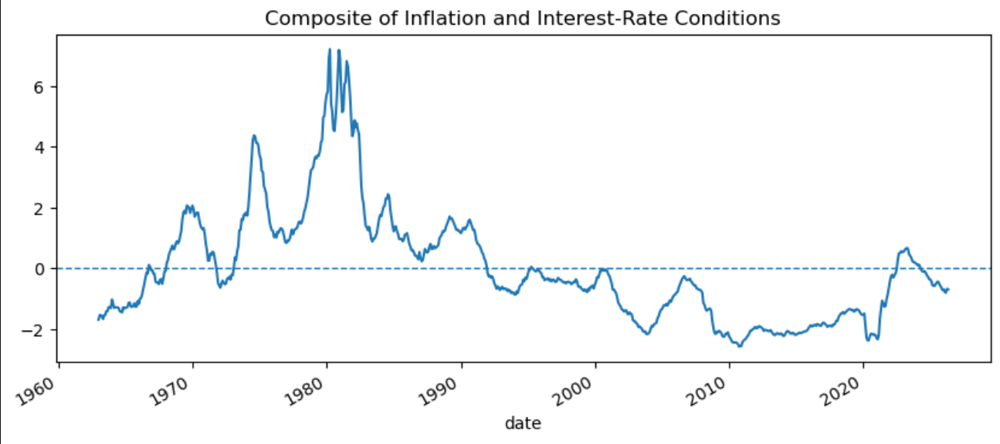

# Macro Stress Analysis: How Interest Rates Track Inflation

Python analysis of 60+ years of US inflation and interest-rate data (1962–2025), built to test whether the policy rate reacts to inflation, whether rate changes signal future inflation, and how inflation and rates combine into a single view of macro conditions. Data is pulled live from the Federal Reserve Economic Data (FRED) API.



## Data

Four monthly series from FRED:

| Series | FRED code | Description |
|--------|-----------|-------------|
| Headline CPI | `CPIAUCSL` | Consumer Price Index, all urban consumers |
| Core CPI | `CPILFESL` | CPI excluding food and energy |
| Fed funds rate | `FEDFUNDS` | Effective federal funds rate (policy rate) |
| 10-Year Treasury | `DGS10` | 10-year Treasury constant maturity yield |

Daily Treasury yields were resampled to monthly averages so all four series share a monthly frequency. After aligning the series and dropping rows with missing values, the working dataset covers **766 months, January 1962 to November 2025**.

## Questions

1. Is inflation pressure easing or persistent, and does headline or core CPI better capture ongoing cost pressure?
2. Do changes in the policy rate signal future inflation?
3. Can inflation and interest-rate levels be combined into a single macro-conditions indicator?
4. How does the policy rate respond to past inflation?

## Method

* Pulled raw series from FRED, set datetime indexes, and resampled daily Treasury yields to monthly averages.
* Derived year-over-year and month-over-month inflation from the CPI indexes, plus 6-month rolling averages to smooth short-term noise.
* For Q2, created forward-shifted inflation variables (3, 6, 12 months ahead) and correlated them with monthly rate changes.
* For Q3, standardized core inflation and the rate level with `StandardScaler`, then summed the z-scores into a composite index.
* For Q4, created backward-shifted inflation variables (3, 6, 12 months prior) and correlated them with the fed funds rate.

## Findings

**The policy rate tracks past inflation closely.** The fed funds rate correlates around 0.70 with core inflation from 3, 6, and 12 months earlier (0.73, 0.73, 0.70). Headline inflation shows a similar but slightly lower relationship (about 0.67 to 0.70). This is consistent with policy responding to inflation that has already appeared in the data, and core inflation lines up with the rate a little more consistently than headline.



**Rate changes do not signal future inflation in this setup.** Monthly changes in the policy rate correlate weakly with inflation 3 to 12 months ahead (roughly 0.03 to 0.13). The forward-looking relationship is far weaker than the backward-looking one: policy reacting to inflation comes through clearly, while any effect of rate moves pushing inflation forward does not show up in a plain correlation.

**Headline inflation is noisier than core.** Headline CPI swings more than core across the full period, which is expected given food and energy volatility. Core gives a steadier read on underlying cost pressure, which is also why it aligns better with the policy rate.



**The combined indicator** built from standardized core inflation and the rate level peaks during the early-1980s inflation period and again in 2021–2023, and sits below its long-run average through the low-rate 2010s.



## Limitations

This is exploratory analysis, and the framing matters:

* The relationships are **correlational, not causal.** A high correlation between the rate and past inflation is consistent with policy reacting to inflation, but the analysis does not prove that mechanism or rule out other drivers.
* The **composite indicator is descriptive, not validated.** It has not been tested against any outcome such as recessions, credit defaults, or market drawdowns, so it summarizes conditions rather than predicting stress.
* Correlation here is **linear and pairwise.** It does not capture nonlinear effects, regime changes, or variables outside the four series used.

## Tools

Python, pandas, NumPy, Matplotlib, Seaborn, scikit-learn, fredapi.

## Running it

1. Install dependencies:
```bash
   pip install -r requirements.txt
```
2. Get a free FRED API key from the FRED website.
3. Create a local `my_config.py` containing your key:
```python
   FRED_API_KEY = "your_key_here"
```
   This file is listed in `.gitignore` and is kept out of version control. Never commit your API key.
4. Run the notebook top to bottom.
